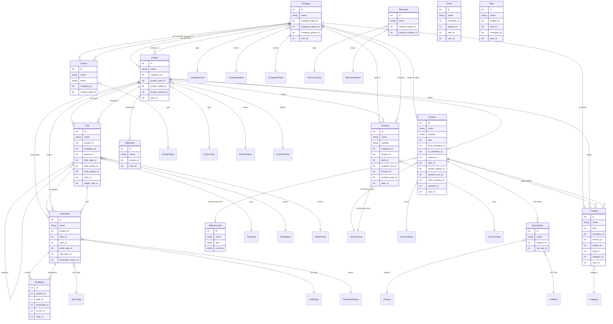

# Data model

The Caflou API manages two broad categories of data: **transactional objects** (records users create day-to-day) and **master data** (configuration and reference data that transactional objects refer to by ID).

---

## Entity relationship diagram



---

## Transactional objects

These are the core business records. Each has a list endpoint, a detail endpoint, and typically create/update/delete endpoints.

### Company (`/companies`)

The root entity in Caflou. Represents a customer, supplier, partner, or prospect. Most other objects ultimately link back to a company.

Key fields: `name`, `kind` (customer/supplier/prospect), `company_type_id`, `company_status_id`, `company_phase_id`, `user_id` (owner/responsible user), `user_ids` (all assigned users), `ic` (company reg. no.), `dic` (VAT number), `email`, `phone`, `website`, `tags`.

Relationships:
- Has many **Contacts** (`contacts.company_id`)
- Has many **Projects** (`projects.company_id`)
- Appears on **Invoices** as buyer (`to_company_id`) or seller (`from_company_id`)
- Appears on **Transfers** (`transfers.company_id`)
- Appears on **Contracts** (`contracts.company_id`)
- Appears on **Events** (`events.company_id`)

### Contact (`/companies/{company_id}/contacts` or `/contacts`)

An individual person associated with a company. Readable via the flat `/contacts` endpoint; create/update requires the company-nested path.

Key fields: `name`, `email`, `phone`, `mobile`, `company_id`, `contact_type_id`, `position`, `website`, `city`, `country`, `tags`.

Relationships:
- Belongs to one **Company** (`company_id`)
- Typed by **ContactType** (`contact_type_id`) — Category B master data

### Project (`/projects`)

A unit of work, typically linked to a company. The primary container for tasks, timesheets, and documents.

Key fields: `name`, `company_id`, `company_ids` (multi-company association), `project_type_id`, `project_status_id`, `project_priority_id`, `user_id` (owner), `user_ids` (all assigned), `start_date`, `end_date`, `budget`, `task_ids`.

Relationships:
- Belongs to one primary **Company** (`company_id`), optionally more (`company_ids`)
- Has many **Tasks** (via `tasks.project_id`)
- Has many **Timesheets** and **TimeEntries**
- Can be linked to **Invoices**, **Transfers**, **Contracts**, **Events**, **ToDos**, **Milestones**, **BudgetItems**

### Task (`/tasks`)

A work item inside a project. Supports subtasks via `parent_id` (self-referential).

Key fields: `name`, `project_id`, `company_id`, `parent_id` (subtask parent), `task_type_id`, `task_status_id`, `task_priority_id`, `user_id` (creator), `target_user_id` (assignee), `user_ids` (all assigned), `due_date`, `estimated_hours`.

Relationships:
- Belongs to one **Project** (`project_id`), optionally also to a **Company** (`company_id`)
- Parent/child tasks via `parent_id` (self-reference)
- Has many **Timesheets** and **TimeEntries**
- Can be linked to **Invoices** (`invoices.task_id`), **Contracts** (`contracts.task_id`), **ToDos**, **Events**

### Document / Invoice (`/invoices`)

A financial or commercial document. The underlying API resource is `invoices`, but it covers all document types — issued invoices, received invoices, proforma invoices, offers, order confirmations, delivery notes, credit notes (storno), tax receipts, and contracts (not to be confused with the separate Contract entity). The `numeric_row_id` determines the document type and its numbering sequence.

Key fields: `name`, `number`, `kind` (integer enum), `from_company_id` (seller), `to_company_id` (buyer), `project_id`, `task_id`, `invoice_status_id`, `numeric_row_id`, `bank_account_id`, `online_payment_account_id`, `contract_id`, `currency`, `date_of_issue`, `date_of_payment`, `date_of_tax`, `paid`, `total_cache`, `user_id`.

Cross-document links: `invoice_ids`, `proforma_ids`, `offer_ids`, `order_ids`, `delivery_ids`, `storno_ids`, `tax_receipt_ids` — arrays of related document IDs.

Relationships:
- Buyer company: **Company** (`to_company_id`)
- Seller company: **Company** (`from_company_id`)
- Optionally linked to **Project** and **Task**
- Has many **InvoiceItems** (line items with product, qty, price, VAT)
- Settled by one or more **Transfers** (`transfers.invoice_id`)
- Numbered by **NumericRow** (`numeric_row_id`)
- Paid to **BankAccount** (`bank_account_id`)
- Status tracked by **InvoiceStatus** (Category B)

### Timesheet (`/timesheets`)

A timesheet groups multiple time entries for a user on a project/task for a given period. Time entries are the individual tracked segments.

Key fields: `name`, `project_id`, `task_id`, `company_id`, `user_id`, `work_type_id`, `rate_type_id`, `timesheet_status_id`, `invoice_ids` (billed on these invoices), `product_id`.

Relationships:
- Belongs to **Project** and optionally **Task**
- Contains many **TimeEntries** (`time_entries.timesheet_id`)
- Typed by **WorkType** and **RateType** (Category B)
- Status tracked by **TimesheetStatus** (Category B)

### TimeEntry (`/time_entries`)

An individual tracked work interval. Belongs to a timesheet.

Key fields: `project_id`, `task_id`, `company_id`, `timesheet_id`, `to_do_id`, `user_id`, `start_date`, `start_time`, `end_date`, `end_time`, `hours`, `invoice_ids`.

### Transfer (`/transfers`)

A cash flow record — an income or expense entry, optionally linked to an invoice.

Key fields: `company_id`, `invoice_id`, `project_id`, `task_id`, `category_id`, `kind` (income/expense), `name`, `amount`, `currency`, `date`, `source_id` (bank connection), `user_id`.

Relationships:
- Belongs to **Company**, optionally **Invoice**, **Project**, **Task**
- Categorized by **Category** (= TransferCategory, Category B)

### Contract (`/contracts`)

A standalone contract document (distinct from the Invoice entity). Supports e-signing.

Key fields: `name`, `number`, `company_id`, `project_id`, `task_id`, `contract_type_id`, `numeric_row_id`, `invoice_id`, `offer_id`, `order_id`, `proforma_id`, `user_id`, `valid_from`, `valid_to`, `value`, `currency`.

Relationships:
- Belongs to **Company**, optionally **Project** and **Task**
- Numbered by **NumericRow**
- Typed by **ContractType** (Category B)
- Has many **ContractItems** (line items)
- Can be linked to an **Invoice**

### Event (`/events`)

A calendar event. Can be linked to a company, project, and/or task.

Key fields: `name`, `company_id`, `project_id`, `task_id`, `user_id`, `user_ids` (all attendees), `start_date`, `end_date`.

### ToDo (`/to_dos`)

A personal task/to-do item. Can be linked to a project, task, and/or company.

Key fields: `name`, `project_id`, `task_id`, `company_id`, `user_id`, `deadline`, `start_date`, `planned_hours`, `finished`.

### Milestone (`/projects/{project_id}/milestones`)

A named checkpoint within a project.

Key fields: `name`, `project_id`, `user_id`, `deadline`, `finished`.

### Resource (`/resources`)

A bookable resource (room, vehicle, equipment, etc.).

Key fields: `name`, `resource_type_id`, `resource_status_id`, `description`.

Relationships:
- Typed by **ResourceType** (Category B)
- Status tracked by **ResourceStatus** (Category B)

### Comment (`/comments`)

A comment on any entity. Polymorphic: `commented_type` + `commented_id` identifies the target (Project, Task, Company, Invoice, etc.).

Key fields: `text`, `commented_type`, `commented_id`, `user_id`, `is_private`, `comment_id` (reply-to).

### Upload (`/uploads`)

A file attachment. Polymorphic: can be attached to any entity (project, task, company, invoice, contract, resource, event, timesheet, transfer, etc.).

Key fields: `name`, `url`, `file_type`, `size`, `company_id`, `project_id`, `task_id`, `invoice_id`, `contract_id`, `event_id`, `timesheet_id`, `transfer_id`, `resource_id`, `user_id`.

### BankAccount (`/bank_accounts`)

A bank account of the Caflou account holder. Used on invoices and transfers for specifying where payment should be sent.

Key fields: `name`, `iban`, `number`, `currency`, `bank_name`, `swift`, `company_id` (optional link to a company).

### BankConnection (`/bank_connections`)

An online banking integration (Open Banking / API connection to a bank). Automatically imports statements as Transfers.

Key fields: `name`, `bank_name`, `status`, `pair_invoices`, `pair_transfers`, `pairing_method`, `source_id`.

---

## Master data — Category A

These types have their own dedicated list/get API endpoints and are synced explicitly with `caflou masterdata sync`. They are identified by integer IDs and referenced by transactional objects.

| Type | Endpoint | Writable | Description |
|------|----------|----------|-------------|
| `vat_rates` | `/vat_rates` | Yes | VAT percentages (e.g. 21%, 12%, 0%) used on invoice and contract line items |
| `numeric_rows` | `/numeric_rows` | Yes | Document numbering series; `kind` field (issued, received, proforma, offer, storno, etc.) determines which document types use which sequence |
| `bank_accounts` | `/bank_accounts` | Yes | Bank accounts of the Caflou account holder, referenced on invoices and transfers |
| `hour_rates` | `/hour_rates` | Yes | Default billing rates per hour, used on timesheets |
| `project_hour_rates` | `/project_hour_rates` | Yes | Hour rates scoped to specific projects, override the global hour rates |
| `payment_rules` | `/payment_rules` | Yes | Default payment terms (e.g. "30 days net") that can be attached to invoices |
| `online_payment_accounts` | `/online_payment_accounts` | Yes | Online payment gateway configurations (e.g. Stripe, GoPay) |
| `resources` | `/resources` | Yes | Bookable resources (rooms, equipment, vehicles) — also a transactional object |
| `workflow_causes` | `/workflow_causes` | Yes | Reasons for workflow state transitions, scoped by entity type |
| `products` | `/products` | Yes | Product/service catalogue items that can be added as line items to invoices and contracts |
| `tags` | `/tags` | No | Free-form labels that can be attached to companies, projects, tasks, contacts, etc. |
| `countries` | `/countries` | No | ISO country list used for company and contact addresses |
| `account_users` | `/account_users` | No | Users who have access to the Caflou account (read-only via API) |
| `pair_models` | `/pair_models` | No | Templates for pairing financial records |
| `units` | `/settings/units` | No (via settings PATCH) | Units of measure (pieces, hours, kg, etc.) used on invoice line items |

---

## Master data — Category B

These types have **no dedicated API endpoints**. Their IDs and names appear as attributes on transactional entity records (e.g. `task_type_id` / `task_type_name` on a task). They are managed only through the Caflou web UI.

The CLI discovers and caches them by scanning entity records — either passively as a side-effect of `list`/`get` commands, or explicitly via `caflou masterdata sync`.

| Type | Source entity | ID field | Name field |
|------|--------------|----------|------------|
| `task_types` | tasks | `task_type_id` | `task_type_name` |
| `task_statuses` | tasks | `task_status_id` | `task_status_name` |
| `task_priorities` | tasks | `task_priority_id` | `task_priority_name` |
| `project_types` | projects | `project_type_id` | `project_type_name` |
| `project_statuses` | projects | `project_status_id` | `project_status_name` |
| `project_priorities` | projects | `project_priority_id` | `project_priority_name` |
| `company_types` | companies | `company_type_id` | `company_type_name` |
| `company_statuses` | companies | `company_status_id` | `company_status_name` |
| `company_phases` | companies | `company_phase_id` | `company_phase_name` |
| `invoice_statuses` | invoices | `invoice_status_id` | `invoice_state_name` |
| `timesheet_statuses` | timesheets | `timesheet_status_id` | `timesheet_status_name` |
| `work_types` | timesheets | `work_type_id` | `work_type_name` |
| `rate_types` | timesheets | `rate_type_id` | `rate_type_name` |
| `transfer_categories` | transfers | `category_id` | `category_name` |
| `contact_types` | contacts | `contact_type_id` | `contact_type_name` |
| `contract_types` | contracts | `contract_type_id` | `contract_type_name` |
| `resource_types` | resources | `resource_type_id` | `resource_type_name` |
| `resource_statuses` | resources | `resource_status_id` | `resource_status_name` |

---

## Relationships at a glance

```
AccountUser (User)
    │
    ├── owns/creates → Company, Project, Task, Invoice, Transfer, Contract, Event
    │
Company ──< Contact           (contact.company_id)
         │
         ├──< Project ──< Task ──< Task (subtasks, parent_id)
         │             │         └──< Timesheet ──< TimeEntry
         │             │         └──< ToDo
         │             │         └──< Event
         │             │
         │             ├──< Timesheet ──< TimeEntry
         │             ├──< Milestone
         │             ├──< Event
         │             ├──< ToDo
         │             └──< BudgetItem
         │
         ├──< Invoice (as buyer: to_company_id)
         │        └──< InvoiceItem ──> Product ──> VatRate
         │        └──< Transfer (invoice_id)
         │        └──> NumericRow   (numbering series)
         │        └──> BankAccount  (payment destination)
         │        └──> InvoiceStatus
         │
         ├──< Invoice (as seller: from_company_id)
         │
         ├──< Transfer ──> Category (transfer_categories)
         │              └──> Invoice (settles invoice)
         │
         └──< Contract ──< ContractItem ──> Product ──> VatRate
                        └──> NumericRow
                        └──> Invoice (linked invoice)

Master data (Category B — inferred from entity fields, no own endpoints):
    Project → ProjectType, ProjectStatus, ProjectPriority
    Task    → TaskType, TaskStatus, TaskPriority
    Company → CompanyType, CompanyStatus, CompanyPhase
    Contact → ContactType
    Invoice → InvoiceStatus
    Timesheet → WorkType, RateType, TimesheetStatus
    Transfer → TransferCategory (= Category)
    Contract → ContractType
    Resource → ResourceType, ResourceStatus
```

---

## Notes on polymorphic relationships

Several entities attach to other entities without a fixed foreign key — the target is identified by a `(type, id)` pair:

| Entity | Polymorphic fields | Can attach to |
|--------|-------------------|---------------|
| Comment | `commented_type` + `commented_id` | Project, Task, Company, Invoice, Contract, Resource, Event |
| Upload | per-entity `_id` fields | Company, Project, Task, Invoice, Contract, Event, Timesheet, Transfer, Resource, Product |
| Address | `addressable_type` + `addressable_id` | Company, Project |
